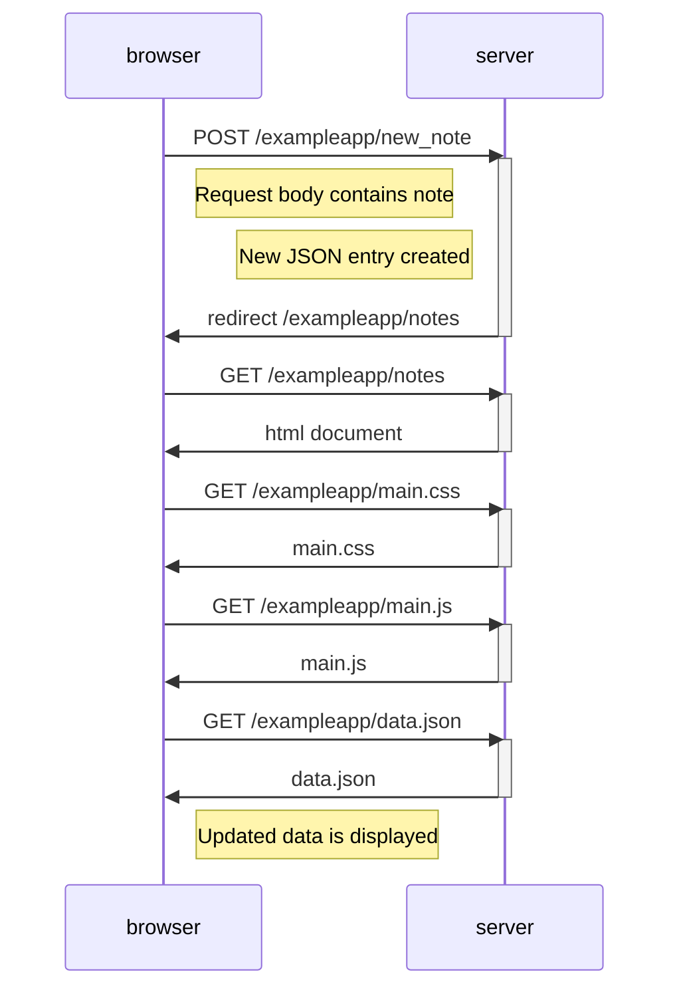

```mermaid
sequenceDiagram
    participant browser
    participant server

    browser->>server: POST /exampleapp/new_note
    activate server
    Note right of browser: Request body contains note
    Note left of server: New JSON entry created
    server->>browser: redirect /exampleapp/notes
    deactivate server
    browser->>server: GET /exampleapp/notes
    activate server
    server->>browser: html document
    deactivate server
    browser->>server: GET /exampleapp/main.css
    activate server
    server->>browser: main.css
    deactivate server
    browser->>server: GET /exampleapp/main.js
    activate server
    server->>browser: main.js
    deactivate server
    browser->>server: GET /exampleapp/data.json
    activate server
    server->>browser: data.json
    deactivate server
    Note right of browser: Updated data is displayed
```