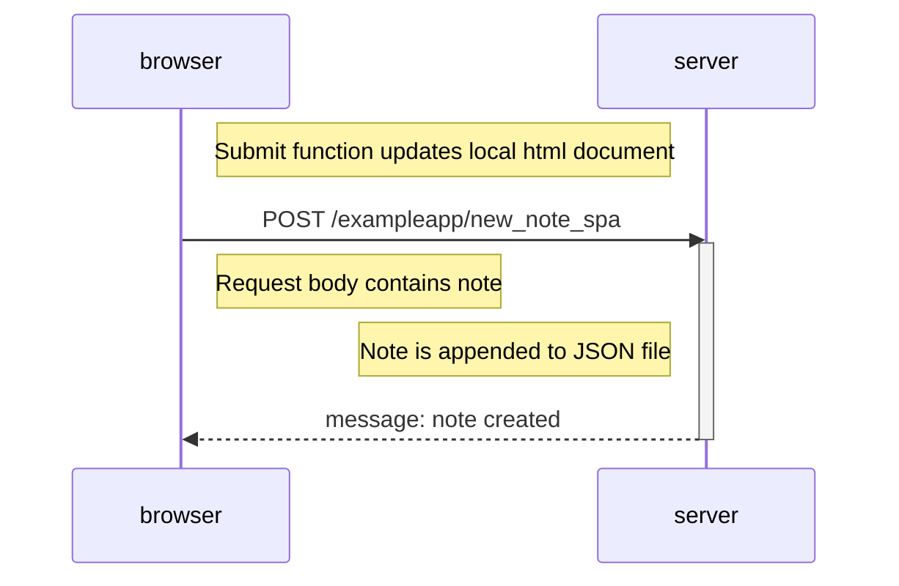

```mermaid
sequenceDiagram
    participant browser
    participant server

    Note right of browser: Submit function updates local html document
    browser->>server: POST /exampleapp/new_note_spa
    activate server
    Note right of browser: Request body contains note
    Note left of server: Note is appended to JSON file
    server-->>browser: message: note created
    deactivate server
```