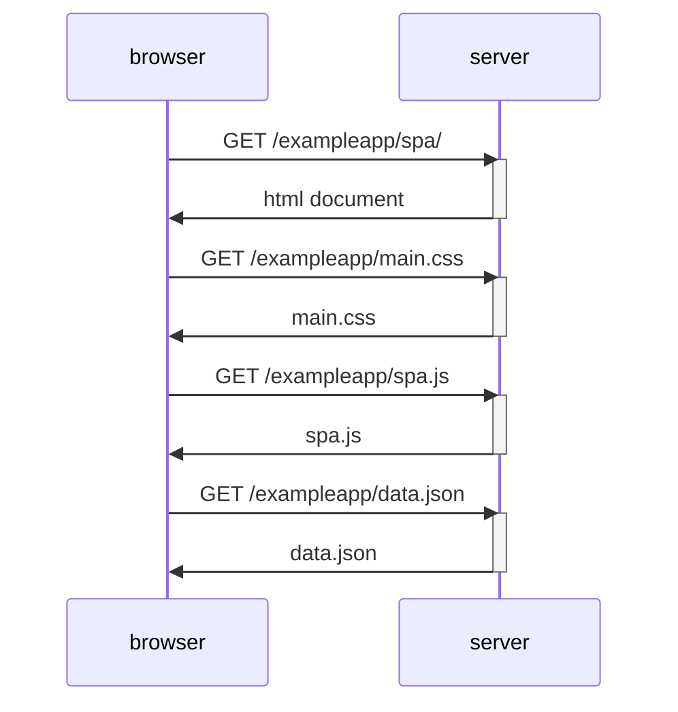

```mermaid
sequenceDiagram
    participant browser
    participant server

    browser->>server: GET /exampleapp/spa/
    activate server
    server->>browser: html document
    deactivate server
    browser->>server: GET /exampleapp/main.css
    activate server
    server->>browser: main.css
    deactivate server
    browser->>server: GET /exampleapp/spa.js
    activate server
    server->>browser: spa.js
    deactivate server
    browser->>server: GET /exampleapp/data.json
    activate server
    server->>browser: data.json
    deactivate server
```